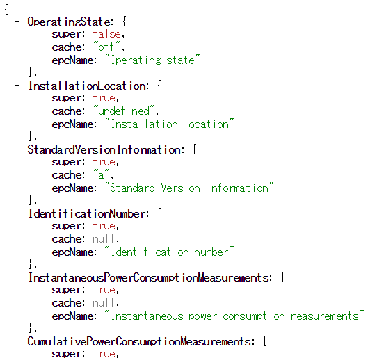

A minimalist's [Housing Web API](http://www.daiwahouse.co.jp/lab/HousingAPI/) gateway that supports ECHONET Lite. The license is MIT.
The primary distribution site is [here](https://github.com/KAIT-HEMS/PicoGW).

# Installation & Running

**Check your node.js version**

```bash
$ node -v
```

The recommended node.js version is v6.11.1. [Newer versions has a bug in libuv](https://github.com/nodejs/node/issues/13581). After the original distribution adopts the bugfix, PicoGW should also work on the newer version.
<!-- We develop this software on node.js v7.6. If you are using an older version, we recommend to update to the latest one. -->

**Setup**

Clone this repository and install necessary node.js libraries.

```bash
$ git clone --depth 1 https://github.com/KAIT-HEMS/PicoGW.git
$ cd PicoGW
$ npm i
```

**Running**

```bash
$ node main.js
```

**Web access**

Access **8080 port** of the running machine from your favorite Web browser.
Follow the instruction shown in the opened page.

## Additional settings

**Background execution**

The first line is necessary only for first time. The second line should be executed in PicoGW directory.
```bash
$ sudo npm install forever -g
$ forever start main.js
```

**Stop background execution**

```bash
$ forever stop main.js
```


**Changing the server port**

```bash
$ node main.js -p 12345
```

**Changing the maker code**

Change v1/plugins/echonet/controller_properties.json's "8a" value.

## Remarks

+ Even if your Linux has multiple network interfaces, ECHONET Lite communication is available for only one of them. It is because [NetworkManager](https://wiki.gnome.org/Projects/NetworkManager) (the tool we use to setup network configuration) sets only one default gateway (which is used for ECHONET Lite multicasting) per machine. By default, NetworkManager sets wired Ethernet as the default gateway network interface. If no wired ethernet connection is available, wlan0 (or other wireless network) will become the default.

# Web API

The Web API hosted by PicoGW is a developing version of [Housing API by Daiwa House Industry.](http://www.daiwahouse.co.jp/lab/HousingAPI/) The API design is mainly done by [Shigeru Owada@Kanagawa Instuitute of Technology](https://github.com/sowd). If you have any criticisms, requests, or questions, please feel free to post your opinion to the [Issues page](https://github.com/KAIT-HEMS/PicoGW/issues).

## Design concept

The concept of this API is as follows:

1. **Simple and easy**. The API basecally follows the concept of REST. At the same time, we tried not to be too strict to the concept. The API can violate the conceptual correctness to achieve easiness. We also put effort to keep source code small, because large source code hampers wide commitments.
2. **Extensible**. The API should support the forthcoming IoT devices without drastically changing the basic calling styles. We adopt plugin architecture to achieve this.
3. **Maximize the merit for residents**. Most home gateway system are developed by home appliances companies. PicoGW should be independent from the pressure from such industry and conservatively implement really necessary, minimal functionalities.

## Calling convention

The API call is a simple HTTP access to the PicoGW server's 8080 port by default. The result is always given as a JSON object. Most APIs exist under **/v1/** (The root **/** access shows the control panel.)
You can always write the API code in the URL field of your browser (HTTP GET access). 

# API directory

The API has a directory structure as follows. The directories right under root (admin / echonet) are the name of plugins. This can increase if new plugin is added to the system.


The structures under a plugin name is a responsibility of the plugin. However, each subdirectory API follows the rule that the resulting JSON object contains further subdirectory name or leaf node name (which is associated with a function).

## Admin Plugin

### GET /v1/admin

Admin plugin root. Currently, the admin plugin is responsible to network and server management.

#### GET /v1/admin/net

The network object in the admin plugin.

This object monitors ARP table and associates IP address with the MAC address to detact change of IP address. PicoGW currently only support IPv4 network. Internally, the detected MAC address is exposed to other plugin to trace devices.

#### GET /v1/admin/server_status

Runs 'vmstat' command to monitor server memory and other statuses.

## ECHONET Lite Plugin

### GET /v1/echonet
This path is the ECHONET Lite plugin root.
The API call returns ECHONET Lite devices ID (internally generated unique ID) with their MAC address and current IP address.

#### GET /v1/echonet/[DeviceID]
ECHONET Lite device object.
[DeviceID] is the unique name of ECHONET Lite device. This call returns ECHONET Lite device's Property IDs (EPC) and its cached value (if exists), and whether the property only exists in the super class (see ECHONET Lite specification). Example call result is :



#### GET /v1/echonet/[DeviceID]/[PropertyID]

GET access to the ECHONET Lite property.
This API will send GET request to a ECHONET Lite device and wait until the result is obtained. The API will return error if preset timeout time has past (30 seconds)
If a vaild value is obtained, the value is stored in the device's cache.

#### PUT /v1/echonet/[DeviceID]/[PropertyID]
This will set a new value (EDT) to the property. Thew new value is specified in the body text as a JSON object:

>{"value":NEWVAL}

This request header must contain "Content-type: application/json".  
There are serveral ways to specify NEWVAL:
1. An array of bytes in decimal digit such as **[48]**.
2. If you want to set it as a hex array, each hex number should be specifies as a string such as **["0x30"]**.
3. If the length of the array is exactly one, you can directly write the element itself such as **48** or **"0x30"**.
4. Exceptionally, some properties supports more meaningful string such as **"on"** or **"off"**.

#### GET /v1/echonet/[REGEXP]/[PropertyID]

ECHONET Lite plugin supports regular expression for device names. For example:

> PUT http://192.168.1.10:8080/v1/echonet/.+/OperatingState/

with the body text as {"value":"0x30"} will set 0x30 to all existing devices's OperatingState.

> GET http://192.168.1.10:8080/v1/echonet/(GenericIllumination_1|AirConditioner_1)/OperatingState/

will obtain OperatingState of a light and an airconditioner at once. Note that the response time is dominated by the slowest device.

PropertyID cannot accept regular expression (because it can easily be many!)

## Database Plugin

Database plugin provides an API for simple key-value database within GW.
The (arbitrary ) path becomes the key of the data.
Also, the source code of database plugin is a good example of basic plugin implementation. If you want to develop your own plugin, please refer to v1/plugins/db/index.js.

#### GET /v1/db

List of all stored keys.

#### GET /v1/db/[PATH_AS_A_KEY]

returns the stored value.

#### PUT|POST /v1/db/[PATH_AS_A_KEY]

Stores a value (specified in the body). The value should be in JSON format. It is stringified before stored. The written value is published from the specified path using PubSub.

#### DELETE /v1/db/[PATH_AS_A_KEY]

Deletes the key and the corresponding data. Publishes {}.

#### DELETE /v1/db

Deletes all data. (/v1/db path remains.)

# v2 API

The PicoGW's v2 API, specified by the prefix /v2/, is in an experimental stage. Therefore, continuity of this API is not guaranteed.
Currently, there is nothing under /v2/ except /v2/function. By calling APIs under /v2/function/, some elements are added under /v2/.


## v2 Aliasing API

One or more human readable or shorter name can be assigned to each API path. This functionality is called as 'Aliasing'.

#### GET /v2/function/alias

Shows the list of currently defined aliases

#### POST /v2/function/alias/[ALIAS_NAME]

Parameter object (specified in body): {"path":"[Associated API path]"}

Defines new alias with the specified path.

#### PUT /v2/function/alias/[ALIAS_NAME]

Parameter object (specified in body): {"path":"[Associated API path]"}

Replaces existing alias text with the specified path.

#### DELETE /v2/function/alias/[ALIAS_NAME]

No parameter is necessary.

Deletes an existing alias.

#### GET|POST|PUT|DELETE /v2/[ALIAS_NAME]

API call by the alias name, rather than the associated full API path.


## Named pipe API

Named pipe can be used as a transport of PicoGW API. It is convenient to access PicoGW's functionality within a single machine. To use this API, please first make two named piped files (by the **mkfifo** command), which must have the unique prefix with two kinds of postfices (_r and _w). For example :

```bash
$ mkfifo np_r np_w
```
will create a pair of named pipes. *np* in the example above can be an arbitrary vaild string.
Then, PicoGW must be launched with **--pipe** option supplied with unique prefix:
```bash
$ node main.js --pipe np
```
In this mode, PicoGW will halt until the client that accesses the named pipe is connected. The client must open *_r* file with read only mode, while *_w* with write mode.

The API call should be written to *_w* file as a string followed by a newline "\n". The string is a stringified JSON object such as:

```
{"method":"GET","path":"/v1/echonet/AirConditioner_1/OperatingState/","tid":"RANDOM_STR"}
```
**tid** is the transaction id of the request, which is used to match request and reply (multiple request causes unordered reply.)  
To set a new value:
```
{"method":"PUT","path":"/v1/echonet/AirConditioner_1/OperatingState/","args":{"value":["0x30"]},"tid":"RANDOM_STR"}
```
For PUT case, **args** key is necessary.
Make sure that this request itself must not contain a newline "\n".

The API result can be obtained from reading the *_r* file.

## PubSub

Connection-based API transports (named pipe and in future, websocket) support PubSub model.

#### Subscribe
Send the following JSON to the transport. (wildcard is not supported now)

> {"method":"SUB","path":"/v1/echonet/AirConditioner_1/OperatingState"}

Then a value change is asynchronously notified by a PUB JSON object.

#### Unsubscribe

> {"method":"UNSUB","path":"/v1/echonet/AirConditioner_1/OperatingState"}

## Licenses

#### MIT

**Browser**  
[JSON Editor](https://github.com/jdorn/json-editor)  
[jsTree](https://www.jstree.com/)  
[jQuery](https://jquery.com/)  
[jQuery UI](https://jqueryui.com/)  
[marked](https://github.com/chjj/marked)  
[spin.js](http://spin.js.org/)  
  
**npm**  
[arped](https://www.npmjs.com/package/arped)  
[body-parser](https://www.npmjs.com/package/body-parser)  
[echonet-lite](https://www.npmjs.com/package/echonet-lite)  
[express](https://www.npmjs.com/package/express)  
[inpath](https://www.npmjs.com/package/inpath)  
[ipmask](https://www.npmjs.com/package/ipmask)  
[mime](https://www.npmjs.com/package/mime)  
[node-localstorage](https://www.npmjs.com/package/node-localstorage)  
[opts](https://www.npmjs.com/package/opts)  
[pidof](https://www.npmjs.com/package/pidof)  
[ping](https://www.npmjs.com/package/ping)  
[read](https://www.npmjs.com/package/read)  
[sudo](https://github.com/calmh/node-sudo)  

#### Apache 2

**npm**  
[websocket](https://www.npmjs.com/package/websocket)  

#### No license

[cryptico](https://www.npmjs.com/package/cryptico)  
